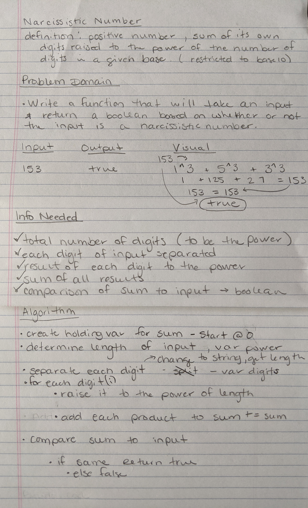

## Problem Domain
- Write a function that will return true or false depending upon whether the given number is a Narcissistic number in base 10.

- **Definition** A Narcissistic Number is a positive number which is the sum of its own digits, each raised to the power of the number of digits in a given base. In this Kata, we will restrict ourselves to decimal (base 10).

## Example
- Input: 153 
- Output: true

## Solution

## Big O

- Time: O(n)
- Space: O(n)

## Test Considerations

- Check that input is a number
- Try numbers of varied lengths
- Test numbers that contain a 0
- Check for negative numbers

### Tracking Info

- Source: Code Wars
- Date Completed: Aug. 20, 2020