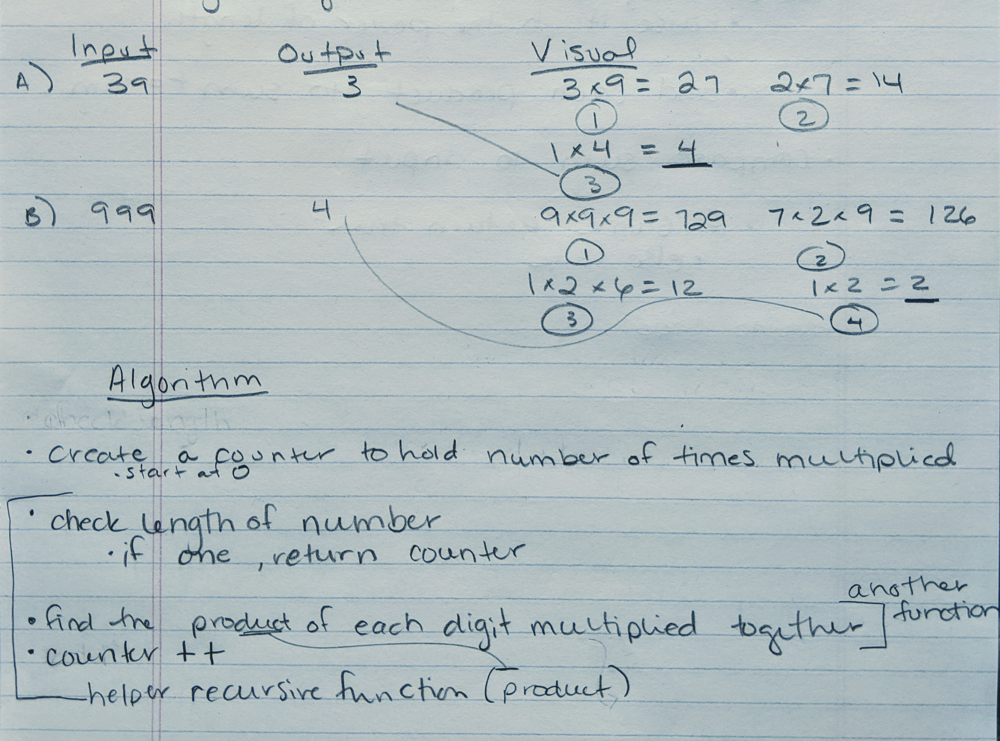

## Problem Domain

- Write a function that takes in a positive number and returns it's multiplicative persistence
- **multiplicative persistence** number of times you must multiply the digits until you reach a single digit

## Example

- Input: 39, Output: 3
- Input: 999, Output 4

## Solution

## Big O

- Time: 
- Space: 

## Test Considerations
- numbers with only one digit
- numbers containing a 0
- large numbers
- only run if arg is a positive number

### Tracking Info

- Source: Code Wars
- Date Completed: Aug 25, 2020